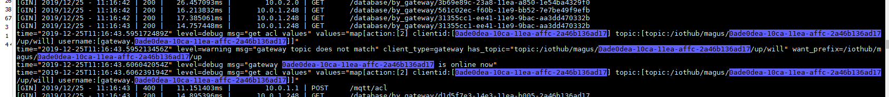

# md格式书写方法
## 1.标题(实例)

# 这是一级标题
## 这是二级标题
### 这是三级标题
#### 这是四级标题
##### 这是五级标题
###### 这是六级标题

## 2.字体

**这是加粗字体**


*这是倾斜的文字dsdddddd*
   
***这是斜体加粗的文字sdddddddddd***

~~这是加删除线的文字~~

## 3.引用

>这是引用内容
>>这是引用内容
>>>这是引用内容

## 4.分割线
---
***

## 5.图片



## 6.超链接
[百度](http://www.baidu.com)

## 7.列表
    无序列表用-+*任何一种都可以
 
- 列表内容
- 列表内容
+ 列表内容
* 列表内容


    列表嵌套：上一级和下一级之间敲三个空格即可

- 一级无序列表
   - 二级无序列表
   - 二级无序列表
   - 二级无序列表
- 一级无序列表
   - 二级无序列表
   - 二级无序列表
   - 二级无序列表
## 8.代码

单行代码

`代码内容`

代码块

```
代码内容
```


   
   
